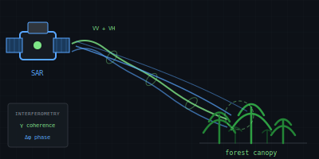
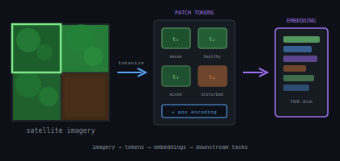

# COLM KEYES

**// EARTH OBSERVATION × FOREST INTELLIGENCE**

 

Building AI systems that monitor forests from space. I work at the intersection of satellite remote sensing, foundation models, and agentic AI — turning radar signals and spectral data into tools that help protect and understand the world's forests.

 

---

 

## 📡 SAR & InSAR Remote Sensing

Working with **Synthetic Aperture Radar** for all-weather, day-night forest monitoring. I build coherence-based pipelines for change detection, biomass estimation, and forest structure analysis using interferometric techniques. Tracking the next generation of L-band and P-band missions — **NISAR** and **BIOMASS** — that will transform how we measure forests from space.

  

 

---

 

## 🧠 Foundation Models for Earth Observation

Leveraging **pre-trained vision transformers** for forest analysis tasks. These models learn rich representations from massive EO datasets, enabling few-shot transfer to specific applications like disturbance detection, species classification, and change mapping. Working with embedding-based approaches for unsupervised forest zone classification and semantic segmentation.

  

 

---

 

## 🤖 Agentic AI Systems

Building **autonomous AI agents** that orchestrate Earth observation workflows. These systems combine conversational interfaces with tool-use capabilities — coordinating satellite data retrieval, model inference, and analysis pipelines through natural language. The goal: make forest monitoring accessible without requiring users to write code or understand complex data formats.

  

 

---

 

  <a href="https://www.linkedin.com/in/colm-keyes-4960a5132/">LinkedIn</a> · Dublin, Ireland

